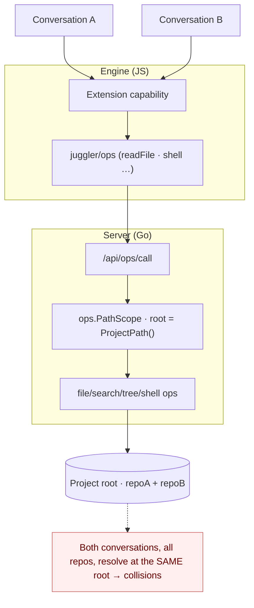
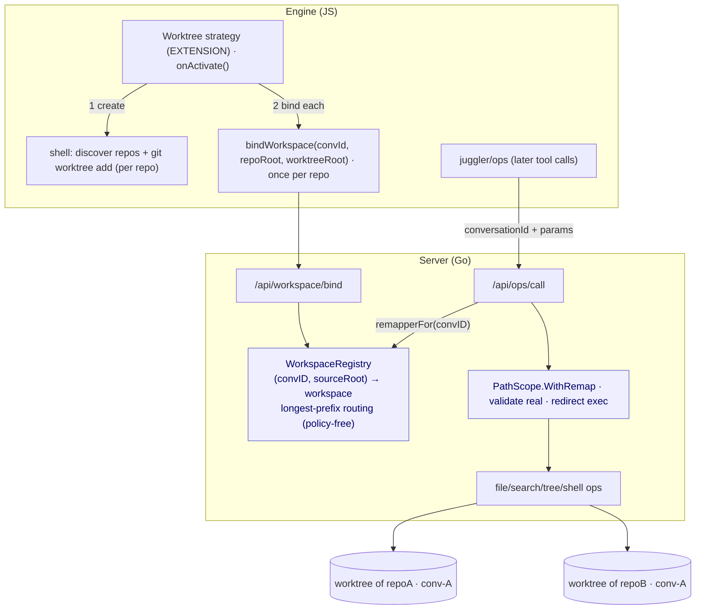

# Worktrees as an extension (issue #51)

## Context

[Issue #51](https://github.com/juggler-ai/juggler/issues/51) and
[PR #40](https://github.com/juggler-ai/juggler/pull/40) asked for per-conversation
git worktrees so two conversations (side-tabs) editing one repository don't
clobber each other. The maintainer's steer was explicit:

> in juggler the approach would be to implement them as an **extension**, not to
> just bake the concept into the core app. So it's a case of either finding an
> elegant way to do them via the current extension API, or finding the right
> abstraction to add to the API that would let someone add worktrees and other
> types of similar workflow as extensions.

An added hard requirement: a conversation may manipulate **more than one git
repository**, and each repo it touches should get its own dedicated worktree.

**TL;DR.** Zero API change is impossible — no extension surface can change
*where* a conversation's file/shell ops physically execute. The missing
abstraction is small and general: a **per-(conversation, source-directory)
execution-root binding**, routed by longest-prefix match. Core gains one
indirection (a path remap) plus a bind API and stays completely ignorant of git;
the entire worktree policy lives in an ordinary extension
(`examples/extensions/juggler-worktrees/`). The multi-repo requirement is what
forces this shape over t3code's simpler one (below). The same primitive enables
devcontainer / remote-dev / sandbox extensions.

## How t3code does it (and why we diverge)

t3code (`apps/server/src/git`, `apps/server/src/vcs/GitVcsDriver.ts`,
`.plans/git-integration-branch-picker-worktrees.md`):

- A thread carries a single **`worktreePath: string | null`** (and one
  `branch`). One worktree per thread, for one branch.
- The agent session is **re-rooted wholesale**: the session cwd is
  `activeThread.worktreePath ?? activeProject.cwd`, and every git op is
  `git -C <cwd> …`. There is no per-operation redirection.
- Worktrees are created by `git worktree add`, defaulting to a sibling
  `../{repo}-worktrees/{branch}` (branch slashes sanitized); a `removeWorktree`
  exists. Cross-repo PR branches are namespaced `t3code/pr-<n>/<head>`.
- **It is single-repo by construction.** A thread has exactly one `worktreePath`;
  multi-repo-per-thread is not modelled.

The load-bearing consequence: **a single session cwd can point at exactly one
worktree.** t3code's model therefore *cannot* satisfy "each of N repos a
conversation touches gets its own worktree." To support that, the binding must
be **per source directory** and applied **per path** (route each path to the
worktree of the repo that contains it), not as one session-wide cwd. That is the
one place we deliberately go beyond t3code — everything else (create via
`git worktree add`, a `juggler/conv-<id>` branch, sibling-ish worktree dirs) is
the same idea.

## What an extension can and cannot do today

An extension contributes capabilities through `web/sdk/` (see
`docs/extension_guide.md`): Context Items (tools), Strategies (shape the loop),
Commands, and a system-prompt contribution. A Context Item can *run*
`git worktree add` (it calls `shell`), and a Strategy owns per-conversation
lifecycle (`onActivate`) and path influence (`defaultAllowedPaths`) — but **none
can change where a conversation's *subsequent* ops execute.** Every
file/shell/search/tree op reaches Go and resolves against one process-global
project root (`ops.PathScope` rooted at `Server.ProjectPath()`). That is the
wall: there is no extension-facing way to say "for this conversation, run ops on
this path under a different root." So "elegant way via the current API" isn't
possible — we need the new abstraction.

## The abstraction: per-(conversation, source) workspace bindings

Core provides only:

1. **A path remap on `ops.PathScope`.** `WithRemap(fn)`: paths are still
   *validated* in real-project space (the security boundary is unchanged), then
   the resolved path is *redirected*. `file_ops` needs zero changes;
   search/tree/shell inherit it.
2. **A registry + bind API.** `server.WorkspaceRegistry` maps
   `(convID, sourceRoot) → workspaceRoot` (policy-free — core never learns what
   the roots *are*). A path is routed to the workspace of the **longest-prefix**
   bound source that contains it, so a repo and its nested repo each map to their
   own worktree; a path under no bound source is untouched. Endpoints:
   `POST /api/workspace/{bind,unbind}`.
3. **SDK surface.** `juggler/ops` exports
   `bindWorkspace(convId, sourceRoot, workspaceRoot)` / `unbindWorkspace(convId,
   sourceRoot?)`, and `StrategyType` gets `this.bindWorkspace(sourceRoot,
   workspaceRoot)` / `this.unbindWorkspace(sourceRoot?)` conveniences.

The worktree **policy** — discovering the repos under the project, creating a
worktree per repo, naming branches, teardown — lives entirely in an extension
(`examples/extensions/juggler-worktrees/`). Core stays ignorant of git; it only
does prefix routing over bindings the extension supplies.

### Before — every conversation resolves at the one project root



### After — an extension binds one workspace per repo; core routes by longest prefix



### Runtime sequence — the worktree strategy (multi-repo)

```mermaid
sequenceDiagram
  participant W as Worker (Go)
  participant X as Worktree strategy (ext)
  participant S as Server ops/workspace (Go)
  participant G as git

  W->>X: run-strategy-hook onActivate(convId)
  X->>S: shell "find .git … ; git worktree add (per repo)"  (project root)
  S->>G: git worktree add -b juggler/conv-<id> <wtA> HEAD   (repoA)
  S->>G: git worktree add -b juggler/conv-<id> <wtB> HEAD   (repoB)
  S-->>X: stdout: "repoA<TAB>wtA" / "repoB<TAB>wtB"
  loop per repo
    X->>S: POST /api/workspace/bind {convId, sourceRoot, workspaceRoot}
    S->>S: WorkspaceRegistry.Bind(convId, sourceRoot, workspaceRoot)
  end
  X-->>W: onActivate resolves
  Note over W,S: subsequent tool calls carry conversationId
  W->>S: /api/ops/call {conversationId, path=repoB/x.go}
  S->>S: WithRemap → longest-prefix(repoB) → <wtB>/x.go
  S-->>W: op runs inside repoB's worktree
```

## How the pieces map to code

| Concern | Location | Policy? |
|---|---|---|
| Execution-root remap | `ops/validation.go` — `PathScope.WithRemap`/`BaseDir`/`Remap`/`ResolveReal` | core, policy-free |
| Ops honour the remap | `ops/{search,tree,shell}_ops.go`, `server/handlers/ops_api.go` | core |
| conversationId on tool calls | `web/sdk/context-item.js` `_withConv`, `web/js/services/ops-api.js`, `fs.js`, per-tool call sites | core |
| Registry (`(conv, source)→workspace`, longest-prefix) | `server/workspace_registry.go` | core, policy-free |
| Bind API | `server/workspace_api.go`, `POST /api/workspace/{bind,unbind}` | core |
| SDK | `web/sdk/ops.js`, `web/sdk/strategy-type.js` | core |
| **Worktree policy (discover repos, worktree each, bind each)** | `examples/extensions/juggler-worktrees/` | **extension** |

## Alternatives considered

- **New `Workspace`/`Environment` capability type** with `prepare`/`teardown`.
  Most self-describing; models devcontainers/remote cleanly. But it's a whole new
  capability kind (manifest, loader, registry, precedence) — heavier than a first
  cut needs, and can be layered later over the *same* core remap.
- **A single per-conversation root (t3code-style, PR #54 v1).** Rejected: cannot
  express >1 repo per conversation.
- **Chosen: per-(conversation, source) `bindWorkspace` on the existing Strategy
  surface, longest-prefix routing.** Smallest new API, reuses the strategy
  lifecycle that already exists, supports the multi-repo requirement, and the
  core mechanism it drives is exactly what a future `Workspace` capability would
  drive too. Nothing is foreclosed.

## Open questions for maintainers

1. **Home of the API.** Keep `bindWorkspace` on `StrategyType` (+ raw
   `juggler/ops`), or promote to a first-class `Workspace` capability type?
2. **Lifecycle hooks (the real gap).** An extension has no
   **conversation-deleted** hook to tear worktrees down, and no
   **conversation-resumed** hook to re-bind after a reload/server restart
   (`onActivate` fires once; bindings are in-memory). Add these hooks, or persist
   bindings? Today core clears the *mappings* on delete (safety net) and leaves
   worktrees for manual `git worktree prune`.
3. **Repo discovery cost.** The sample extension discovers repos eagerly with a
   bounded `find` on activation. A lazy "bind on first touch of an unbound repo"
   model would avoid worktrees for untouched repos but needs a core→extension
   callback on an unmatched path — a larger surface. Eager is fine for a first
   cut.

## Status

WIP proof-of-concept. Verified locally on Go 1.26 + real WebKit: core builds,
`go vet` and `golangci-lint` clean, the registry (incl. the multi-repo
longest-prefix case) and an end-to-end ops remap are unit-tested, and the JS
passes `tsc` + `eslint`. The live engine↔worker path for the sample strategy is
exercised by CI, not locally.
