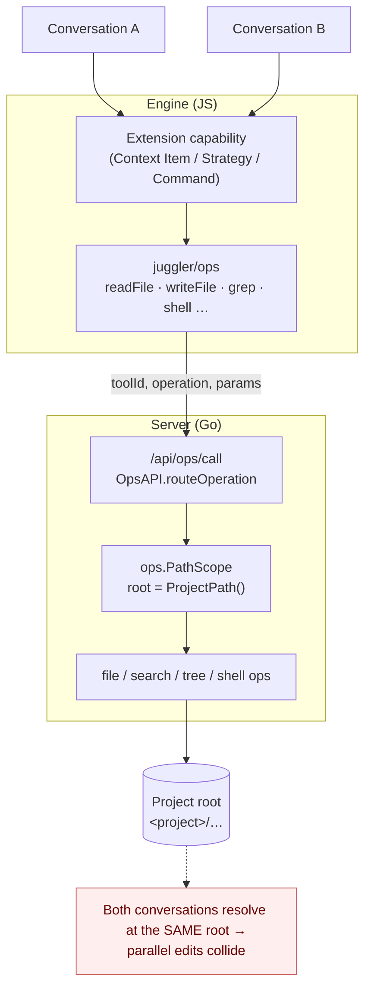
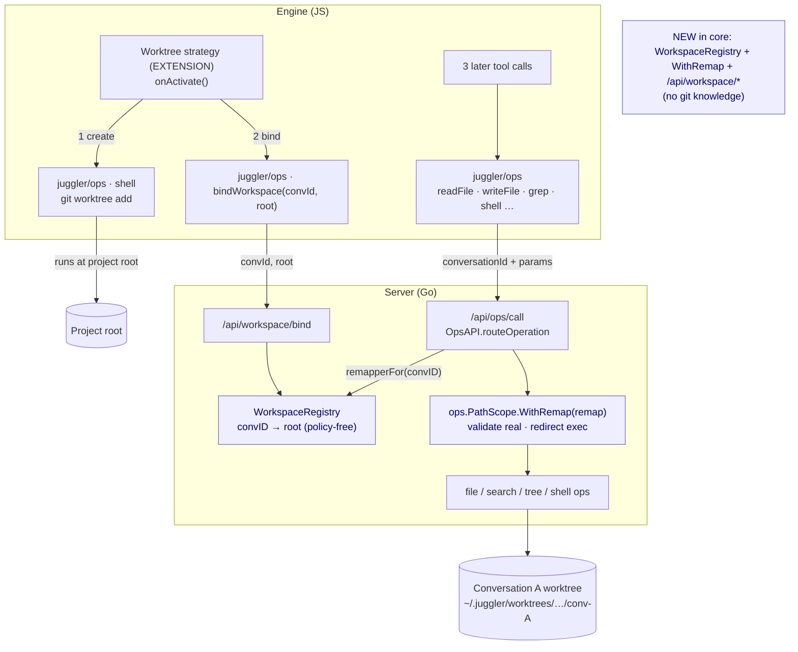
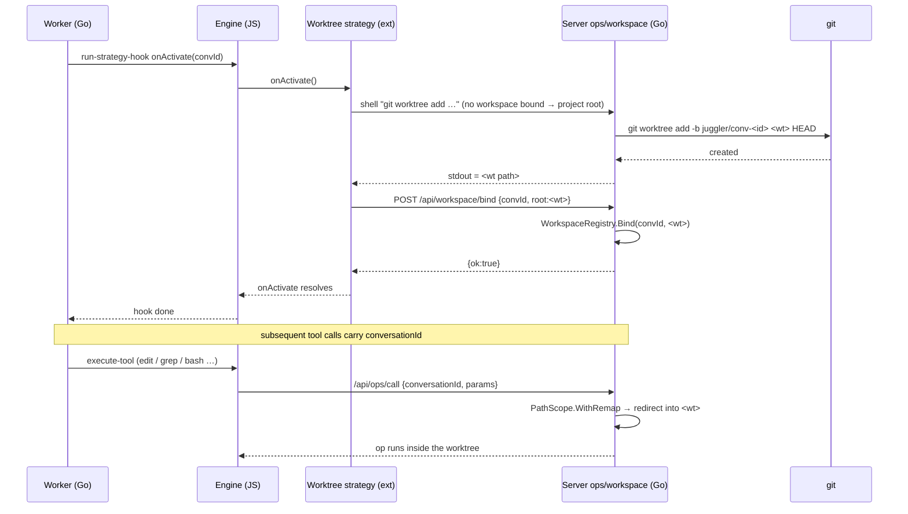

# Worktrees as an extension (issue #51)

## Context

[Issue #51](https://github.com/juggler-ai/juggler/issues/51) and
[PR #40](https://github.com/juggler-ai/juggler/pull/40) asked for per-conversation
git worktrees so two conversations (side-tabs) editing one repository don't
clobber each other. The maintainer's steer was explicit:

> in juggler the approach would be to implement them as an **extension**, not to
> just bake the concept into the core app. So it's a case of either finding an
> elegant way to do them via the current extension API, or finding the right
> abstraction to add to the API that would let someone add worktrees and other
> types of similar workflow as extensions.

This document is the investigation and a WIP proof-of-concept answering that.

**TL;DR.** It cannot be done with zero API change today — no extension surface
can change *where* a conversation's file/shell ops physically execute. The
missing abstraction is small and general: a **per-conversation execution-root
binding**. Core gains one indirection (a conversation → root remap) plus a bind
API; the entire git/worktree policy lives in an ordinary extension. The same
primitive enables devcontainers, remote-dev, and sandbox workflows.

## What an extension can and cannot do today

An extension contributes capabilities through `web/sdk/` (see
`docs/extension_guide.md`):

| Capability | Can it add worktrees? |
|---|---|
| **Context Item** (a tool) | Can *run* `git worktree add` (it calls `shell`), but a tool cannot relocate where *subsequent* ops execute. |
| **Strategy** (shapes the loop) | Owns per-conversation lifecycle (`onActivate`), path influence (`defaultAllowedPaths`), and worker-request primitives (`createThread`/`continueConversation`). The natural host — but still has no way to move the execution root. |
| **Command** (slash command) | One-shot; no execution-root control. |
| **System-prompt contribution** | Text only. |

Every file/shell/search/tree op an extension calls through `juggler/ops` reaches
the Go layer and resolves against **one process-global project root**
(`ops.PathScope` rooted at `Server.ProjectPath()`). That is the wall: **there is
no extension-facing way to say "for this conversation, run ops under a different
root."** So the honest answer to "elegant way via the current API" is: not
possible — we need the right new abstraction.

## The abstraction: a per-conversation *workspace* binding

Introduce the idea of a conversation's **workspace** — an alternate execution
root that an *extension* chooses. Core provides only:

1. **A per-conversation execution-root remap.** `ops.PathScope` gains
   `WithRemap(fn)`: paths are still *validated* in real-project space (the
   security boundary is unchanged), then the resolved path is *redirected* into
   the bound root. `file_ops` needs zero changes; search/tree/shell inherit it.
2. **A registry + bind API.** `server.WorkspaceRegistry` maps `convID → root`
   (policy-free — core never learns what the root *is*). Two endpoints,
   `POST /api/workspace/{bind,unbind}`, let an extension set it.
3. **SDK surface.** `juggler/ops` exports `bindWorkspace(convId, root)` /
   `unbindWorkspace(convId)`, and `StrategyType` gets `this.bindWorkspace(root)`
   / `this.unbindWorkspace()` conveniences.

The git/worktree **policy** — deciding a worktree should exist, creating it,
naming its branch, tearing it down — lives entirely in an extension
(`examples/extensions/juggler-worktrees/`). Core stays ignorant of git.

### Before — every conversation resolves at the one project root

### After — an extension binds each conversation's execution root

### Runtime sequence — the worktree strategy

## How the pieces map to code

| Concern | Location | Policy? |
|---|---|---|
| Execution-root remap | `ops/validation.go` — `PathScope.WithRemap`/`BaseDir`/`Remap`/`ResolveReal` | core, policy-free |
| Ops honour the remap | `ops/{search,tree,shell}_ops.go`, `server/handlers/ops_api.go` | core |
| conversationId on tool calls | `web/sdk/context-item.js` `_withConv`, `web/js/services/ops-api.js`, `fs.js`, per-tool call sites | core |
| Registry | `server/workspace_registry.go` | core, policy-free |
| Bind API | `server/workspace_api.go`, `POST /api/workspace/{bind,unbind}` | core |
| SDK | `web/sdk/ops.js` `bindWorkspace`/`unbindWorkspace`; `web/sdk/strategy-type.js` conveniences | core |
| **Worktree policy** | `examples/extensions/juggler-worktrees/` | **extension** |

## Alternatives considered

- **New `Workspace`/`Environment` capability type** (a class with
  `prepare(convId)→{root}` / `teardown(convId)`). Most general and self-describing;
  cleanly models devcontainers/remote/sandbox. But it's a whole new capability
  kind (manifest `provides.workspaces`, loader, registry, precedence) — heavier
  than warranted for a first cut, and can be layered on later over the same core
  remap.
- **Strategy MANIFEST field / declarative hook returning a root.** Too static:
  creating a worktree is imperative, async, and may fail; it wants a real call,
  not a manifest value.
- **Chosen: an imperative `bindWorkspace` primitive on the existing Strategy
  surface.** Smallest new API, reuses the strategy lifecycle (`onActivate`) that
  already exists, and the core mechanism it drives (`WithRemap` + registry) is
  exactly what a future `Workspace` capability would drive too. Nothing is
  foreclosed.

## Open questions for maintainers

1. **Home of the API.** Keep `bindWorkspace` on `StrategyType` (+ raw
   `juggler/ops`), or promote to a first-class `Workspace` capability type?
2. **Lifecycle hooks.** The one real gap: an extension has no
   **conversation-deleted** hook to tear a workspace down, and no
   **conversation-resumed** hook to re-bind after a reload/server restart
   (`onActivate` fires once). Options: add these hooks, or persist bindings.
   Today core clears the *mapping* on delete (safety net) and leaves the worktree
   for manual `git worktree prune`.
3. **Scope of a workspace.** This PoC binds one root per conversation (a worktree
   of the repo the project lives in). Multi-repo projects (a folder of repos)
   would want per-(conversation, repo) roots — a natural extension of the same
   registry.

## Status

WIP proof-of-concept. Verified locally on Go 1.26: core builds, `go vet` and
`golangci-lint` clean, the workspace registry + remap are unit-tested against
real git, and the JS passes `tsc` + `eslint`. The live engine↔worker path for
the sample strategy is exercised by CI, not locally.
