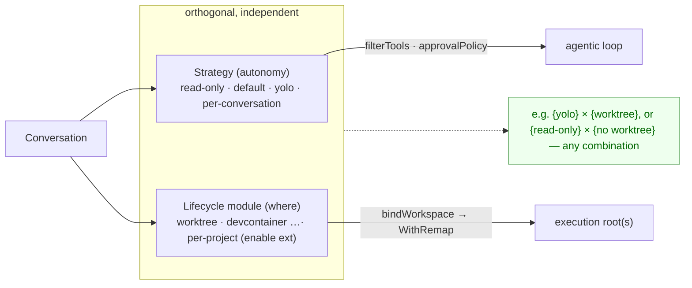
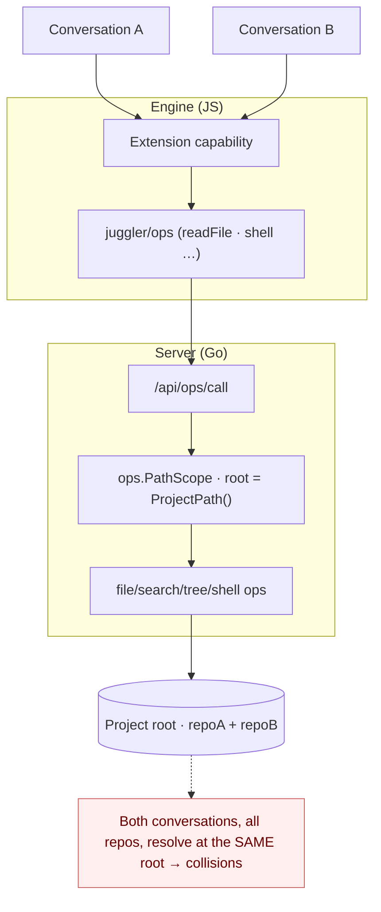

# Worktrees as an extension (issue #51)

## Context

[Issue #51](https://github.com/juggler-ai/juggler/issues/51) and
[PR #40](https://github.com/juggler-ai/juggler/pull/40) asked for per-conversation
git worktrees so two conversations (side-tabs) editing one repository don't
clobber each other. The maintainer's steer was explicit:

> in juggler the approach would be to implement them as an **extension**, not to
> just bake the concept into the core app. So it's a case of either finding an
> elegant way to do them via the current extension API, or finding the right
> abstraction to add to the API that would let someone add worktrees and other
> types of similar workflow as extensions.

An added hard requirement: a conversation may manipulate **more than one git
repository**, and each repo it touches should get its own dedicated worktree.

**TL;DR.** Zero API change is impossible — no extension surface can change
*where* a conversation's file/shell ops physically execute. The missing
abstraction is small and general: a **per-(conversation, source-directory)
execution-root binding**, routed by longest-prefix match. It is driven by a
lightweight **lifecycle module** (manifest `provides.lifecycle`, the same
"plain module the host loads and calls" shape as `systemPrompt`) — *not* a
Strategy, since where-work-happens is orthogonal to loop autonomy. Core gains one
indirection (a path remap) plus a bind API and stays completely ignorant of git;
the entire worktree policy lives in an ordinary extension
(`examples/extensions/juggler-worktrees/`). The multi-repo requirement forces the
per-source binding over t3code's single-cwd model. Opt-in is **per project**
(enable the extension). The same primitive enables devcontainer / remote-dev /
sandbox lifecycle modules.

## How t3code does it (and why we diverge)

t3code (`apps/server/src/git`, `apps/server/src/vcs/GitVcsDriver.ts`,
`.plans/git-integration-branch-picker-worktrees.md`):

- A thread carries a single **`worktreePath: string | null`** (and one
  `branch`). One worktree per thread, for one branch.
- The agent session is **re-rooted wholesale**: the session cwd is
  `activeThread.worktreePath ?? activeProject.cwd`, and every git op is
  `git -C <cwd> …`. There is no per-operation redirection.
- Worktrees are created by `git worktree add`, defaulting to a sibling
  `../{repo}-worktrees/{branch}` (branch slashes sanitized); a `removeWorktree`
  exists. Cross-repo PR branches are namespaced `t3code/pr-<n>/<head>`.
- **It is single-repo by construction.** A thread has exactly one `worktreePath`;
  multi-repo-per-thread is not modelled.

The load-bearing consequence: **a single session cwd can point at exactly one
worktree.** t3code's model therefore *cannot* satisfy "each of N repos a
conversation touches gets its own worktree." To support that, the binding must
be **per source directory** and applied **per path** (route each path to the
worktree of the repo that contains it), not as one session-wide cwd. That is the
one place we deliberately go beyond t3code — everything else (create via
`git worktree add`, a `juggler/conv-<id>` branch, sibling-ish worktree dirs) is
the same idea.

## What an extension can and cannot do today

An extension contributes capabilities through `web/sdk/` (see
`docs/extension_guide.md`): Context Items (tools), Strategies (shape the loop),
Commands, and a system-prompt contribution. A Context Item can *run*
`git worktree add` (it calls `shell`), and a Strategy owns per-conversation
lifecycle (`onActivate`) and path influence (`defaultAllowedPaths`) — but **none
can change where a conversation's *subsequent* ops execute.** Every
file/shell/search/tree op reaches Go and resolves against one process-global
project root (`ops.PathScope` rooted at `Server.ProjectPath()`). That is the
wall: there is no extension-facing way to say "for this conversation, run ops on
this path under a different root." So "elegant way via the current API" isn't
possible — we need the new abstraction.

## The abstraction: per-(conversation, source) workspace bindings

Core provides only:

1. **A path remap on `ops.PathScope`.** `WithRemap(fn)`: paths are still
   *validated* in real-project space (the security boundary is unchanged), then
   the resolved path is *redirected*. `file_ops` needs zero changes;
   search/tree/shell inherit it.
2. **A registry + bind API.** `server.WorkspaceRegistry` maps
   `(convID, sourceRoot) → workspaceRoot` (policy-free — core never learns what
   the roots *are*). A path is routed to the workspace of the **longest-prefix**
   bound source that contains it, so a repo and its nested repo each map to their
   own worktree; a path under no bound source is untouched. Endpoints:
   `POST /api/workspace/{bind,unbind}`.
3. **SDK surface.** `juggler/ops` exports
   `bindWorkspace(convId, sourceRoot, workspaceRoot)` / `unbindWorkspace(convId,
   sourceRoot?)`.
4. **A lifecycle module (NOT a Strategy).** See below.

The worktree **policy** — discovering the repos under the project, creating a
worktree per repo, naming branches, teardown — lives entirely in an extension
(`examples/extensions/juggler-worktrees/`). Core stays ignorant of git; it only
does prefix routing over bindings the extension supplies.

## Driven by a lifecycle module, not a Strategy

Worktrees are **not** a Strategy. A Strategy governs *loop autonomy* — read-only
vs. default vs. yolo — and a conversation has exactly one (`currentStrategyId`,
one `strategy-selector`). "Where the work physically happens" is **orthogonal**:
you might want a yolo worktree, a read-only worktree, or yolo with no worktree at
all. Bundling worktrees into a Strategy would consume the single strategy slot
and force "isolated" and "yolo/read-only" to be one choice — a category error.

So the driver is a lightweight **lifecycle module**, the same "plain module the
host loads and calls" shape as the existing `systemPrompt` contribution — *not* a
new capability type with its own selector. Chosen over a full capability type
because per-**project** opt-in is enough here (see the "Axis shape" discussion in
Open questions): a capability type would add a registry, a `currentEnvironmentId`,
selection-keyed dispatch, and a selector UI, none of which per-project opt-in
needs.

- Manifest `provides.lifecycle: "lifecycle.js"` (a single module path, like
  `systemPrompt`). SDK contract: `juggler/lifecycle` (`web/sdk/lifecycle.js`,
  JSDoc typedefs only).
- Default export = a hooks object the host invokes per conversation:
  `onConversationActivated(ctx)` (discover repos + `bindWorkspace` per repo),
  `onConversationDeleted(ctx)` (remove worktrees + `unbindWorkspace`). The delete
  hook is the real conversation-teardown signal.
- Host loader: `runExtensionLifecycleHook(hook, ctx)` in
  `web/js/services/extensions.js`, mirroring `buildExtensionSystemPromptContributions`.
- **Opt-in is per project** — enabling the extension applies it to every
  conversation in the project. It stays orthogonal to Strategy, so it composes
  with any autonomy level.



### Before — every conversation resolves at the one project root



### After — an extension binds one workspace per repo; core routes by longest prefix


### Runtime sequence — the worktree strategy (multi-repo)

```mermaid
sequenceDiagram
  participant W as Worker (Go)
  participant X as Worktree lifecycle module (ext)
  participant S as Server ops/workspace (Go)
  participant G as git

  W->>X: runExtensionLifecycleHook onConversationActivated(convId)
  X->>S: shell "find .git … ; git worktree add (per repo)"  (project root)
  S->>G: git worktree add -b juggler/conv-<id> <wtA> HEAD   (repoA)
  S->>G: git worktree add -b juggler/conv-<id> <wtB> HEAD   (repoB)
  S-->>X: stdout: "repoA<TAB>wtA" / "repoB<TAB>wtB"
  loop per repo
    X->>S: POST /api/workspace/bind {convId, sourceRoot, workspaceRoot}
    S->>S: WorkspaceRegistry.Bind(convId, sourceRoot, workspaceRoot)
  end
  X-->>W: onActivate resolves
  Note over W,S: subsequent tool calls carry conversationId
  W->>S: /api/ops/call {conversationId, path=repoB/x.go}
  S->>S: WithRemap → longest-prefix(repoB) → <wtB>/x.go
  S-->>W: op runs inside repoB's worktree
```

## How the pieces map to code

| Concern | Location | Policy? |
|---|---|---|
| Execution-root remap | `ops/validation.go` — `PathScope.WithRemap`/`BaseDir`/`Remap`/`ResolveReal` | core, policy-free |
| Ops honour the remap | `ops/{search,tree,shell}_ops.go`, `server/handlers/ops_api.go` | core |
| conversationId on tool calls | `web/sdk/context-item.js` `_withConv`, `web/js/services/ops-api.js`, `fs.js`, per-tool call sites | core |
| Registry (`(conv, source)→workspace`, longest-prefix) | `server/workspace_registry.go` | core, policy-free |
| Bind API | `server/workspace_api.go`, `POST /api/workspace/{bind,unbind}` | core |
| Bind SDK | `web/sdk/ops.js` (`bindWorkspace`/`unbindWorkspace`) | core |
| **Lifecycle module** | manifest `provides.lifecycle` (`extmanifest.go`) + served URL (`handlers/extensions.go`); SDK contract `web/sdk/lifecycle.js`; host loader `runExtensionLifecycleHook` (`web/js/services/extensions.js`) | core |
| **Worktree policy (discover repos, worktree each, bind each)** | `examples/extensions/juggler-worktrees/lifecycle.js` | **extension** |

### Remaining wiring (WIP)

The core mechanism, the manifest field + served URL, the SDK `juggler/lifecycle`
contract, and the host loader `runExtensionLifecycleHook` are done and verified.
The one remaining piece needs the running engine: the **call site** that invokes
`runExtensionLifecycleHook('onConversationActivated', {conversationId,
projectRoot})` when the engine first activates a conversation, and
`'onConversationDeleted'` on delete. The substrate exists — the engine already
receives conversation `created`/`deleted` (`conversations-changed`, handled in
`web/js/engine-app.js`) — so this is a small, well-located addition, left out
here only because it can't be exercised without the live engine.

## Alternatives considered

- **On the Strategy axis (PR #54 v1–v2).** Rejected: Strategy is single-select
  (loop autonomy), so a "Worktree strategy" steals the slot you'd use for
  read-only/default/yolo. Worktrees are orthogonal to autonomy — they must be
  their own axis.
- **A single per-conversation root (t3code-style).** Rejected: a single session
  cwd cannot express >1 repo per conversation.
- **A full `Environment` capability type** (own manifest kind, registry,
  `currentEnvironmentId`, selector UI, selection-keyed dispatch). Correct axis,
  but heavier than needed once per-**project** opt-in is accepted.
- **Chosen: a lightweight lifecycle module** (`provides.lifecycle`) driving
  per-(conversation, source) `bindWorkspace` with longest-prefix routing.
  Orthogonal to Strategy, supports multi-repo, per-project opt-in, and reuses the
  established plain-module (`systemPrompt`) loading pattern — the least new
  surface. The same module shape serves devcontainer / remote / sandbox.

## Open questions for maintainers

### 1. Axis shape — full capability type, or a lighter lifecycle module?

**Decision (this PoC): the lifecycle module (b), with per-project opt-in.** The
options below are kept for the record; all drive the *same* core remap
(`bindWorkspace` + `WorkspaceRegistry` + `WithRemap`) and differ only in
packaging and opt-in granularity. Revisit (a)/(c) if per-conversation selection
is later wanted.

Both drive the *same* core remap; they differ only in how the extension is
packaged and how a conversation opts in. Three points on the spectrum:

**(a) Environment capability type.** Manifest `provides.environments`,
a registry, per-conversation `currentEnvironmentId`, an `environment-selector`
UI, and selection-keyed worker→engine dispatch. Heaviest, but gives a
first-class, per-conversation, user-visible mode.

**(b) A lifecycle-subscriber module (chosen — lighter, feasible today).** Modelled
on the existing `provides.systemPrompt`, which is already a *plain module* (not a
class) the host loads and calls. `provides.lifecycle: "lifecycle.js"` whose
default export is a hooks object the engine invokes:

```js
export default {
  async onConversationActivated({ conversationId, projectRoot, shell, bindWorkspace }) { /* worktree + bind */ },
  async onConversationDeleted({ conversationId, unbindWorkspace }) { /* teardown */ },
};
```

The substrate exists — the engine already receives conversation `created`/
`deleted` (`conversations-changed`). This **drops the selector UI,
`currentEnvironmentId`, and selection-keyed dispatch** — genuinely lighter.

**The one real tradeoff is opt-in granularity, not code size.** A subscriber
fires for *every* conversation, so on its own it means **per-project** opt-in
(enable the extension / a config flag) rather than **per-conversation** — which
loses "isolate these tabs but not that one." So:
- If "all conversations in this project run in worktrees" is acceptable → the
  lifecycle module is strictly lighter and sufficient.
- If per-conversation choice with a selector is wanted → you need roughly (a).

**(c) Hybrid (per-conversation, still no capability type).** A `/worktree`
*command* whose only side-effect is the (legitimate, declarative)
`setConversationMetadata` — it just sets a per-conversation flag — plus a
lifecycle module (b) that reads that flag in `onConversationActivated` and binds.
This keeps per-conversation opt-in while reusing Commands + a lifecycle module,
avoiding a new capability type and a bespoke selector. Slightly less discoverable
than a first-class selector.

A `Command` alone cannot do it: commands are viewer-side and declarative
("never perform these operations directly — declare intent, the host
dispatches"), so they can't call `shell`/`bindWorkspace` themselves.

Recommendation: if per-conversation opt-in matters, **(a)** or **(c)**; if
per-project is fine, **(b)** is the least new surface. All three reuse the core
remap unchanged.
2. **Teardown/persistence.** The module's `onConversationDeleted` hook is a real
   conversation-deleted teardown signal. Two things still to decide: whether bindings should
   **persist** (survive a reload/server restart, where `onActivate` won't re-fire)
   or be re-established by an on-resume hook; and the default worktree-cleanup
   policy (prune-if-clean vs. keep). Today core clears the *mappings* on delete
   and the sample removes only clean worktrees.
3. **Repo discovery cost.** The sample discovers repos eagerly with a bounded
   `find` on activation. A lazy "bind on first touch of an unbound repo" model
   would avoid worktrees for untouched repos but needs a core→extension callback
   on an unmatched path — a larger surface. Eager is fine for a first cut.

## Status

WIP proof-of-concept. Verified locally on Go 1.26 + real WebKit: core builds,
`go vet` and `golangci-lint` clean, the registry (incl. the multi-repo
longest-prefix case) and an end-to-end ops remap are unit-tested, and the JS
passes `tsc` + `eslint`. The live engine↔worker path for the sample strategy is
exercised by CI, not locally.
